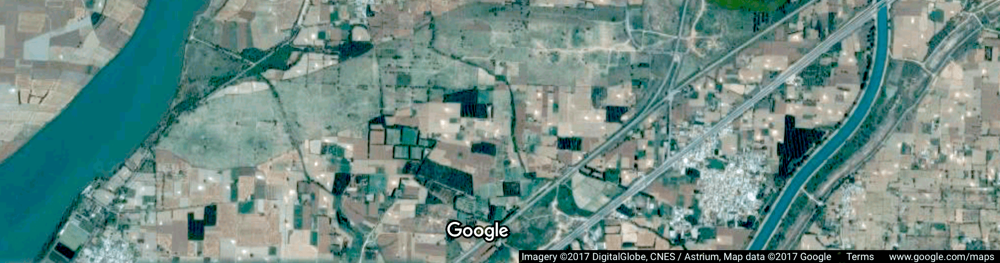
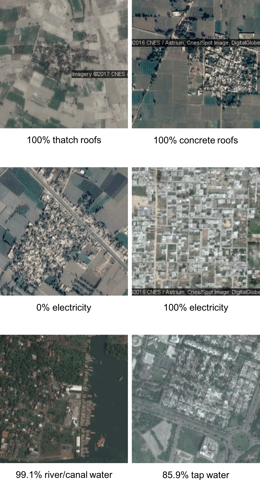
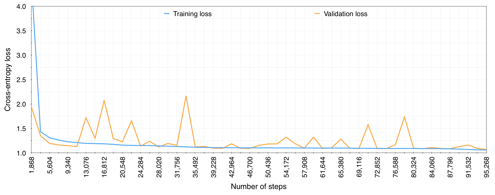
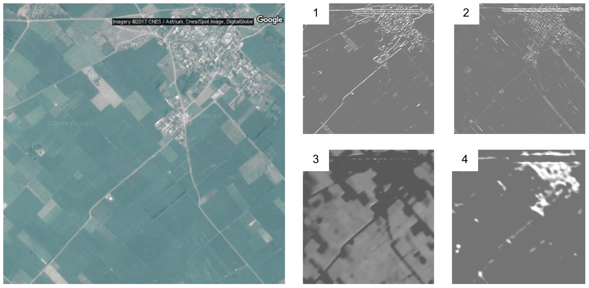
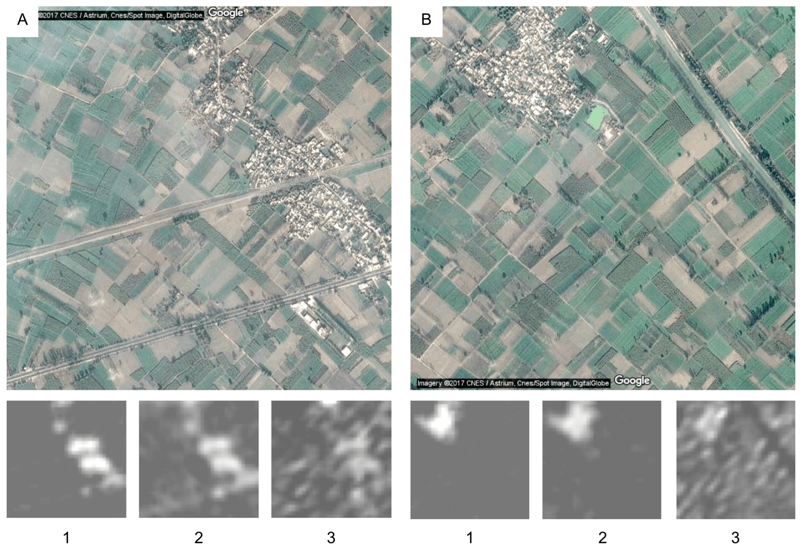
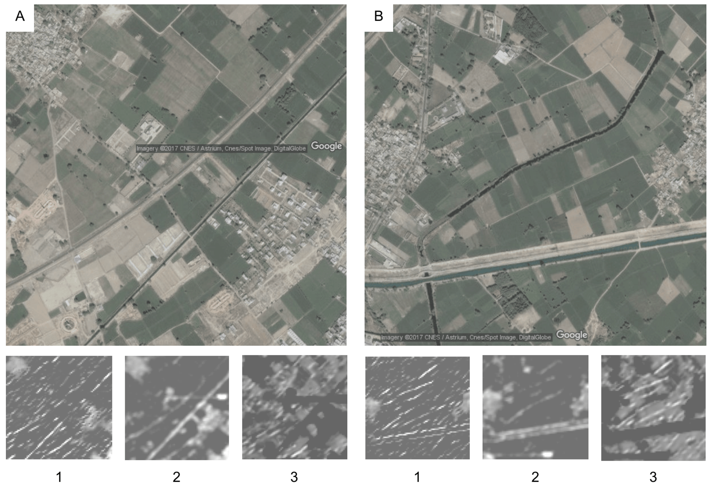

<p align="center">
<b><a href="#introduction">Introduction</a></b>
|
<b><a href="#data-sources">Data Sources</a></b>
|
<b><a href="#sample-images">Sample Images</a></b>
|
<b><a href="#code">Code</a></b>
|
<b><a href="#filter-responses">Filter Responses</a></b>
|
<b><a href="#learning-curve">Learning Curve</a></b>
|
<b><a href="#acknowledgements">Acknowledgements</a></b>
</p>

<a href="https://github.com/agarwalt/satimage">
<div align="center">
	
</div>
</a><br>

#### Introduction

This repository accompanies our publication <a href="https://www.aaai.org/ocs/index.php/AAAI/AAAI18/paper/view/16441" target="_blank">"Multi-Task Deep Learning for Predicting Poverty From Satellite Images"</a> (AAAI Conference on Innovative Applications of Artificial Intelligence: IAAI 2018), and contains the code and model weights for two prediction tasks:

1. Predict, using a multi-task fully convolutional deep neural network (<a href="models/developmental/model.png" target="_blank">PNG</a>, <a href="models/developmental/best_model_architecture.json" target="_blank">JSON</a>, <a href="https://www.dropbox.com/s/187e6zp2or2s9ni/best_model_weights.h5?dl=0" target="_blank">Weights</a>), three developmental parameters -- the main material of the roof, source of lighting and source of drinking water -- from satellite imagery.

	Following are the categories for each of the three tasks in the multi-task model. The multi-task model outputs 24 values (9 for roof type, 6 for source of lighting and 9 for source of drinking water) as three probability distributions, one distribution per task.

	| # | Roof Type        			| Lighting Source           		| Drinking Water Source   	|
	| - | --------------------------------- | ------------------------------------- | ----------------------------- |
	| 1 | Grass/thatch/bamboo/wood/mud      | Electricity 				| Treated tap-water 		|
	| 2 | Plastic/polythene      		| Kerosene 				| Untreated tap-water 		|
	| 3 | Hand made tiles      		| Solar energy 				| Covered well 			|
	| 4 | Machine made tiles      		| Other oil 				| Uncovered well 		|
	| 5 | Burnt brick      			| Any other 				| Handpump	 		|
	| 6 | Stone/slate      			| No lighting 				| Tubewell/borehole 		|
	| 7 | G.I./metal/asbestos      		| 	 				| River/canal	 		|
	| 8 | Concrete      			| 	 				| Tank/pond/lake 		|
	| 9 | Any other material      		| 	 				| Other source	 		|
	

2. Predict, using a simple four-layer fully-connected neural network (<a href="models/income_poverty_pd/model.png" target="_blank">PNG</a>, <a href="models/income_poverty_pd/best_model_architecture.json" target="_blank">JSON</a>, <a href="https://www.dropbox.com/s/ml3hkms3nlx0k0u/best_model_weights.h5?dl=0" target="_blank">Weights</a>), the income levels (a direct indicator of poverty) using the predicted developmental parameter outputs of the first (multi-task) model -- model P.D., trained on predicted data.

3. Predict, using a simple four-layer fully-connected neural network (<a href="models/income_poverty_cd/model.png" target="_blank">PNG</a>, <a href="models/income_poverty_cd/best_model_architecture.json" target="_blank">JSON</a>, <a href="https://www.dropbox.com/s/jk6xhloa6946y9s/best_model_weights.h5?dl=0" target="_blank">Weights</a>), the income levels using the actual developmental parameter values -- model C.D., trained on census data.


#### Data Sources

We obtained the Census of India (2011) data from these websites: 

1. Primary Census Abstract Data Tables: <a href="http://censusindia.gov.in/pca/pcadata/pca.html" target="_blank">http://censusindia.gov.in/pca/pcadata/pca.html</a>
2. Percentage of Households to Total Households by Amenities and Assets: <a href="http://www.censusindia.gov.in/2011census/HLO/HL_PCA/Houselisting-housing-HLPCA.html" target="_blank">http://www.censusindia.gov.in/2011census/HLO/HL_PCA/Houselisting-housing-HLPCA.html</a>
3. Socio-Economic and Caste Census: <a href="http://www.secc.gov.in/statewiseEmploymentAndIncomeReport?reportType=Employment%20and%20Income" target="_blank">http://www.secc.gov.in/statewiseEmploymentAndIncomeReport?reportType=Employment%20and%20Income</a>

We utilized Google's Geocoding API (https://developers.google.com/maps/documentation/geocoding/) to obtain coordinates of the center of a region from its address in the census data.  

Further, we used Google Static Maps API (https://developers.google.com/maps/documentation/static-maps/) to extract 1920x1920 satellite images for the villages at the "16" zoom level.

We provide a small subset of our dataset in this repository to test all three models.

#### Sample Images

Sample satellite images of parts of six different regions are shown below. Labels indicate the percentage of households with a particular roof type, source of lighting or source of drinking water. The satellite images in the paper are scaled down to fit the paper width. Zooming to true size makes, roads, roof types and farms distinctly visible.

<div align="center">
	
</div>
<br>

Developmental parameters are not only related to “direct” features such as roofs and settlements, but also to “indirect” features such as roads and farmlands. For instance, the presence of roads is correlated with high electrification.

#### Code

Use these commands to generate predictions from the three models mentioned earlier and calculate correlation, accuracy, precision and recall on the dataset provided in this repository.

First, clone the repository or download it as a <a href="https://github.com/agarwalt/satimage/archive/master.zip" target="_blank">zip file</a>. To clone:

```bash
git clone "https://github.com/agarwalt/satimage.git"
cd satimage
```

Next, install the required python packages: 
```bash
pip install -r requirements.txt
```

##### Predicting developmental parameters

1. The file <a href="data/region_info.csv" target="_blank">data/region_info.csv</a> contains the centre latitudes and longitudes for some regions from our complete dataset. Use Google's Static Maps API (https://developers.google.com/maps/documentation/static-maps/) to download 1920x1920 satellite images for these regions at the 16 zoom level. The name of each image should be `<region_code>.png`. For example, for the region with `region_code = 12345`, the name of the corresponding image file should be `12345.png`.
2. Download the multi-task model's <a href="https://www.dropbox.com/s/187e6zp2or2s9ni/best_model_weights.h5?dl=0" target="_blank">weights</a> and place the downloaded file in the `models/developmental` folder.
3. Change the working directory (`cd code`) and launch an interactive python shell (e.g. `ipython`).
4. Load the weights from the downloaded file: 
   ```python
   import util
   model = util.restore_model('../models/developmental/best_model_architecture.json', '../models/developmental/best_model_weights.h5')
   ``` 
5. Next, generate and save predictions of developmental parameters from the downloaded images.
   ```python
   import satimage
   satimage.generate_predictions(model, '../images', '../data/predicted_developmental.csv')
   ```
   
   Here, `../images` is the directory where the satellite images are placed. 
   
   The predictions of developmental parameters for regions whose images were downloaded will be written to `data/predicted_developmental.csv`.
   
   Information about headers of the data files is available in `data/developmental_header_detail.txt`.
 
##### Visualizing filter responses

Load the multi-task model using steps `1-4`, as necessary, in the previous section. To see and save filter responses for a particular region and convolutional layer, execute:

```python
import satimage
layer_index = 19
filter_index = None
input_img_path = '../images/12345.png'
save_dir = '../images'
satimage.show_filter_responses(model, layer_index, input_img_path, save_dir, filter_index)
```

A copy of the filter responses will be saved in `save_dir`.

Vary the `layer_index`, `filter_index` and `input_img_path` variables to see responses of filters in different layers. For layer and filter indices, refer to the PNG file depicting the model's architecture in the `models/developmental` folder.

##### Predicting income level and poverty

1. Download model weights, <a href="https://www.dropbox.com/s/ml3hkms3nlx0k0u/best_model_weights.h5?dl=0" target="_blank">model P.D.</a> and <a href="https://www.dropbox.com/s/jk6xhloa6946y9s/best_model_weights.h5?dl=0" target="_blank">model C.D.</a>, and place the downloaded files in `models/income_poverty_pd` and `models/income_poverty_cd` respectively.
3. Change the working directory (`cd code`) and launch an interactive python shell (e.g. `ipython`).
4. Load the models's weights: 
   ```python
   import util
   model_pd = util.restore_model('../models/income_poverty_pd/best_model_architecture.json', '../models/income_poverty_pd/best_model_weights.h5')
   model_cd = util.restore_model('../models/income_poverty_cd/best_model_architecture.json', '../models/income_poverty_cd/best_model_weights.h5')
   ``` 
5. Generate and save predictions of income levels from the developmental parameters (generated in the previous section) using:
   ```python
   import secc
   secc.generate_predictions(model_pd, '../data/predicted_developmental.csv', '../data/region_info.csv', '../data/pd_subdistrict_income.csv')
   secc.generate_predictions(model_cd, '../data/data_developmental.csv', '../data/region_info.csv', '../data/cd_subdistrict_income.csv')
   ```
   
   The predictions of income levels using predicted developmental parameters will be written to `data/pd_subdistrict_income.csv`. The predictions of income levels using actual values of the developmental parameters will be written to `data/cd_subdistrict_income.csv`.
   
   Information about headers of the data files is available in `data/income_header_detail.txt`.

6. To compare the predicted income levels above against ground truth values, and to calculate the accuracy of povery prediction, use:
   ```python
   secc.compare_income_predictions('../data/data_subdistrict_income.csv', '../data/pd_subdistrict_income.csv')  # For model trained on predicted data, model P.D.
   secc.compare_income_predictions('../data/data_subdistrict_income.csv', '../data/cd_subdistrict_income.csv')  # For model trained on census data, model C.D.
   ```

#### Learning Curve

The figure below shows the average training and validation loss for the three tasks in the multi-task model. The minimum validation loss occurs at the last step in the graph. Further training leads to overfitting.

<div align="center">
	
</div>
<br>

#### Filter Responses

We provide filter responses for our first (multi-task) model.

##### Shared Layers

In the multi-task model's first block, consistent with the observations reported in the literature, filters learn edges with different orientations. The figure below shows differently oriented edges for different filters for a particular region.

<div align="center">
	
</div>
<br>

##### Task-specific Layers

The following figures illustrate the filter responses for the task specific branches for each of the three tasks in the multi-task model. In each figure, the larger images show different areas of two regions (`A` and `B`). The smaller images show filter activations for: 

1. Roof type 
2. Source of lighting, and,
3. Source of drinking water. 

In contrast to the activations for shared layers' filters, the activations for the task-specific branches in the multi-task model highlight objects of relevance to the respective tasks.

<div align="center">
	
</div>
<br>

<div align="center">
	
</div>
<br>

<div align="center">
	
</div>
<br>


#### Acknowledgements

The authors are grateful to NVIDIA Corporation for donating the TITAN X GPUs used for this research.
